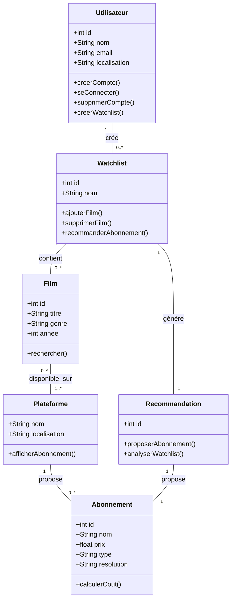

```mermaid
classDiagram
    class Utilisateur {
        +int id
        +String nom
        +String email
        +String localisation
        +creerCompte()
        +seConnecter()
        +supprimerCompte()
        +creerWatchlist()
    }

    class Watchlist {
        +int id
        +String nom
        +ajouterFilm()
        +supprimerFilm()
        +recommanderAbonnement()
    }

    class Film {
        +int id
        +String titre
        +String genre
        +int annee
        +rechercher()
    }

    class Plateforme {
        +String nom
        +String localisation
        +afficherAbonnement()
    }

    class Abonnement {
        +int id
        +String nom
        +float prix
        +String type
        +String resolution
        +calculerCout()
    }

    class Recommandation {
        +int id
        +proposerAbonnement()
        +analyserWatchlist()
    }

    Utilisateur "1" -- "0..*" Watchlist : crée
    Watchlist "1" -- "0..*" Film : contient
    Film "0..*" -- "1..*" Plateforme : disponible_sur
    Plateforme "1" -- "0..*" Abonnement : propose
    Watchlist "1" -- "1" Recommandation : génère
    Recommandation "1" -- "1" Abonnement : propose
```
