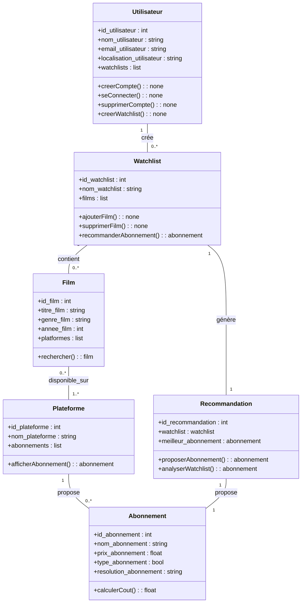

# Diagramme de classes

```mermaid
classDiagram
    class Utilisateur {
        +id_utilisateur : int
        +nom_utilisateur : string
        +email_utilisateur : string
        +localisation_utilisateur : string
        +watchlists : list<watchlist>
        +creerCompte() : none
        +seConnecter() : none
        +supprimerCompte() : none
        +creerWatchlist() : none
    }

    class Watchlist {
        +id_watchlist : int
        +nom_watchlist : string
        +films : list<film>
        +ajouterFilm() : none
        +supprimerFilm() : none
        +recommanderAbonnement() : abonnement
    }

    class Film {
        +id_film : int
        +titre_film : string
        +genre_film : string
        +annee_film : int
        +platformes : list<plateforme>
        +rechercher() : film
    }

    class Plateforme {
        +id_plateforme : int
        +nom_plateforme : string
        +abonnements : list<abonnement>
        +afficherAbonnement() : abonnement
    }

    class Abonnement {
        +id_abonnement : int
        +nom_abonnement : string
        +prix_abonnement : float
        +type_abonnement : bool
        +resolution_abonnement : string
        +calculerCout() : float
    }

    class Recommandation {
        +id_recommandation : int
        +watchlist : watchlist
        +meilleur_abonnement : abonnement
        +proposerAbonnement() : abonnement
        +analyserWatchlist() : abonnement
    }

    Utilisateur "1" -- "0..*" Watchlist : crée
    Watchlist "1" -- "0..*" Film : contient
    Film "0..*" -- "1..*" Plateforme : disponible_sur
    Plateforme "1" -- "0..*" Abonnement : propose
    Watchlist "1" -- "1" Recommandation : génère
    Recommandation "1" -- "1" Abonnement : propose
```
