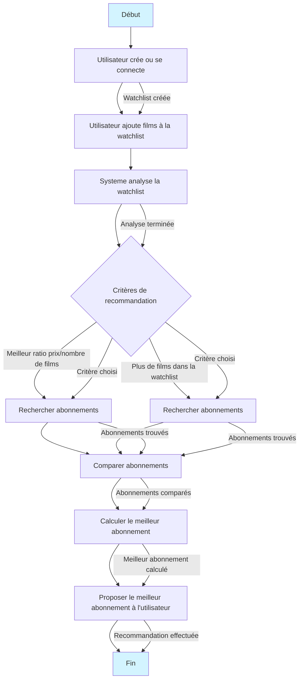

# Diagramme d'activité

```mermaid
flowchart TD
    %% Définition des noeuds
    A[Début] --> B[Utilisateur crée ou se connecte]
    B --> C[Utilisateur ajoute films à la watchlist]
    C --> D[Systeme analyse la watchlist]
    D --> E{Critères de recommandation}
    
    %% Décision sur les critères
    E --> |Meilleur ratio prix/nombre de films| F[Rechercher abonnements]
    E --> |Plus de films dans la watchlist| G[Rechercher abonnements]
    
    %% Recherche des abonnements
    F --> H[Comparer abonnements]
    G --> H[Comparer abonnements]
    
    %% Comparaison et recommandation
    H --> I[Calculer le meilleur abonnement]
    I --> J[Proposer le meilleur abonnement à l'utilisateur]
    J --> K[Fin]

    %% Points de terminaison
    style A fill:#d3f4ff
    style K fill:#d3f4ff

    %% Connecteurs
    B -->|Watchlist créée| C
    D -->|Analyse terminée| E
    E -->|Critère choisi| F
    E -->|Critère choisi| G
    F -->|Abonnements trouvés| H
    G -->|Abonnements trouvés| H
    H -->|Abonnements comparés| I
    I -->|Meilleur abonnement calculé| J
    J -->|Recommandation effectuée| K
```
